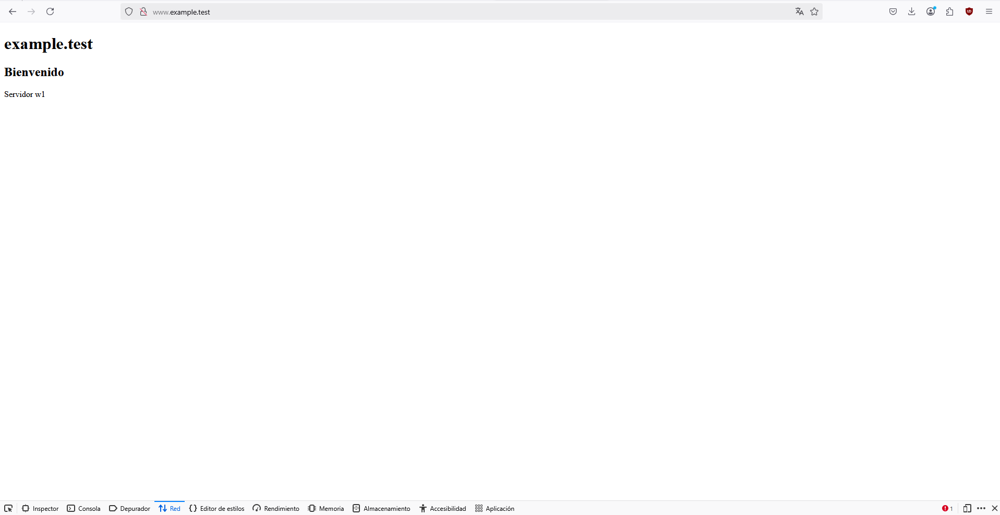
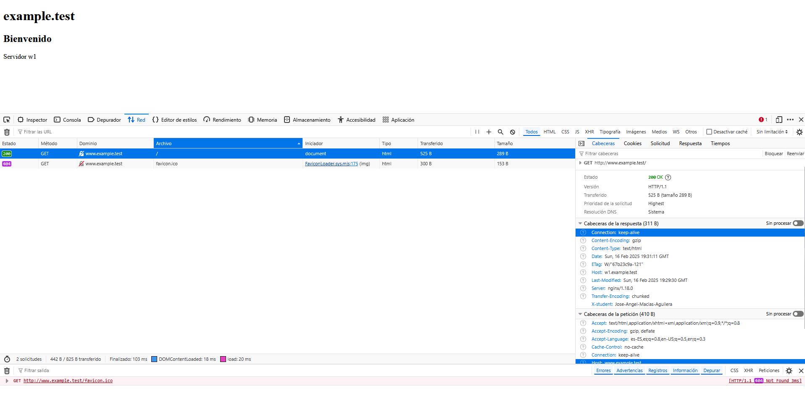

# Aplicacion proxy inverso

## Esta es una practica realizada con vagrant para configurar un proxy que se conectara al servidor, recogera sus datos y los mostrara en el cliente

#### Empecemos por lo basico, ¿Qué es un proxy?

Un proxy es como un intermediario entre tu dispositivo e internet; recibe tus solicitudes, las envía en tu nombre y te devuelve la respuesta. 

#### ¿Cuáles son los beneficios del uso de un proxy?

Puede usarse para mejorar la seguridad, la privacidad o el rendimiento al filtrar tráfico y almacenar en caché contenido lo que resulta en un rendimiento más rapido. 

#### Logs

##### Log de lo que muestra en pantalla

##### Log de las cabeceras configuradas en el servidor y en el proxy

